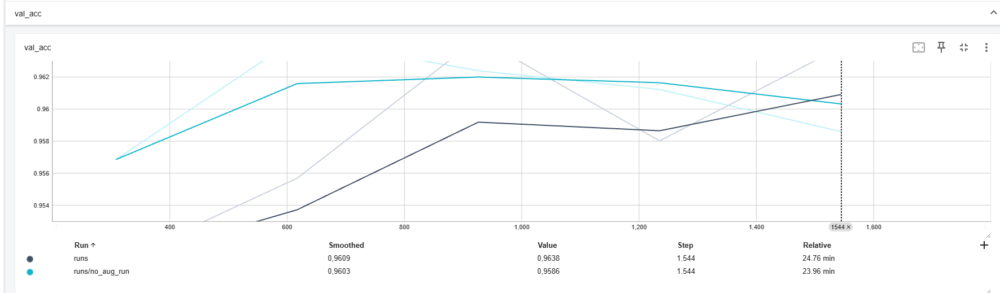
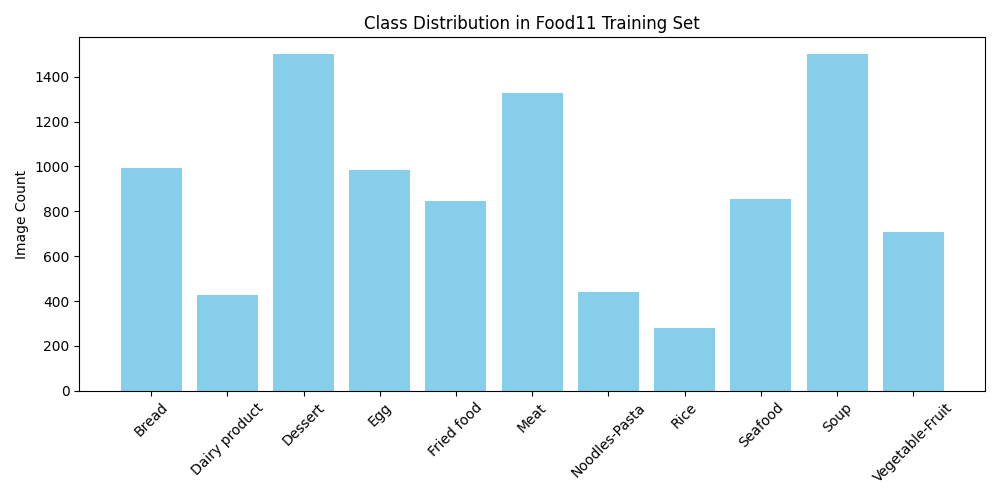

# Food11 types Image Classification with ViT

## Project Description
This project classifies 11 categories of food using a fine-tuned ViT-base model. The dataset used is Food11 from Kaggle. Training was done using PyTorch Lightning, and results are compared to a zero-shot CLIP model. The final model is deployed as a Gradio app on Hugging Face.

### Name & URL
| Name          | URL |
|---------------|-----|
| Huggingface   | *https://huggingface.co/spaces/Skorm/computer-vision-project* |
| Model Repo    | *https://huggingface.co/Skorm/food11-vit* |
| Code          | *https://github.com/Skormer/computer-vision-project* |

## Labels
The 11 food classes are:  
`['Bread', 'Dairy product', 'Dessert', 'Egg', 'Fried food', 'Meat', 'Noodles-Pasta', 'Rice', 'Seafood', 'Soup', 'Vegetable-Fruit']`

## Data Source
| Data Source | Description |
|-------------|-------------|
| [Food11 (Kaggle)](https://www.kaggle.com/datasets/trolukovich/food11-image-dataset) | 2-way split of training and validation across 11 food categories (testing folder has not been included)|
| [OneDrive Link ](https://zhaw-my.sharepoint.com/:f:/g/personal/kaeppkev_students_zhaw_ch/EuGvyiCsPtJDkznJr4c8HlsBqKnLvlituIC587wWb3w5QQ) | Since the data set is too large, I've uploaded the entire dataset used for training the model to my personal OneDrive folder. |

## Data Augmentation
| Augmentation                     | Description |
|----------------------------------|-------------|
| `Resize(224x224)`                | Rescales images |
| `RandomHorizontalFlip()`         | Flips images horizontally |
| `RandomRotation(15)`             | Rotates randomly within ±15° |
| `Normalize(mean=0.5, std=0.5)`   | Standardization |

## Model Training

### Data Split
| Split      | Number of Images |
|------------|------------------|
| Train      | 9866             |
| Validation | 3430             |

## Training Setup
- Model: `google/vit-base-patch16-224`
- Epochs: 5
- Optimizer: AdamW
- Learning Rate: 2e-5
- Loss Function: CrossEntropy
- Logging: TensorBoard

### Training Results

| Epoch | Training Loss | Validation Loss | Validation Accuracy |
|-------|----------------|-----------------|----------------------|
| 1     | 1.2517         | 0.1991          | 95.31%               |
| 2     | 0.4728         | 0.1376          | 96.21%               |
| 3     | 0.2027         | 0.1281          | 96.21%               |
| 4     | 0.2861         | 0.1395          | 95.89%               |
| 5     | 0.2943         | 0.1223          | 96.59%               |

## TensorBoard

Details of training can be found at [Huggingface TensorBoard](https://huggingface.co/Skorm/food11-vit/tensorboard)

| Model/Method                                                         | TensorBoard Link                                      |
|----------------------------------------------------------------------|------------------------------------------------------|
| Transfer Learning with `google/vit-base-patch16-224` (without data augmentation) | runs/no_aug_run/events.out.tfevents.174885...                 |
| Transfer Learning with `google/vit-base-patch16-224` (with data augmentation)  | runs/events.out.tfevents.174835...                |

## 🧪 Comparison of trained model and Zero-Shot model 

| Model/Method                                                         | Accuracy | 
|----------------------------------------------------------------------|----------|
| Transfer Learning with `google/vit-base-patch16-224` (without data augmentation) | 96.59%  (epoch 5)   | 
| Transfer Learning with `google/vit-base-patch16-224` (with data augmentation)  | 95.86%  (epoch 5)    | 
| Zero-shot Image Classification with `openai/clip-vit-large-patch14` by testing with 50 images of each food category | 82.36%      | 

## References

## Reflection

This project allowed me to apply modern image classification techniques using Vision Transformers (ViT) and explore the full machine learning pipeline with PyTorch Lightning. I learned how to structure and train custom models, how to log and compare different training runs using TensorBoard, and how to deploy models using Gradio and Hugging Face Spaces. 

An additional valuable learning experience was comparing the performance of a fine-tuned ViT model with a zero-shot CLIP model. This highlighted the benefits of domain-specific training versus general-purpose models.

Future improvements could include testing stronger data augmentation techniques, training the model further with a larger dataset and evaluating on a dedicated test set to better understand model generalization.